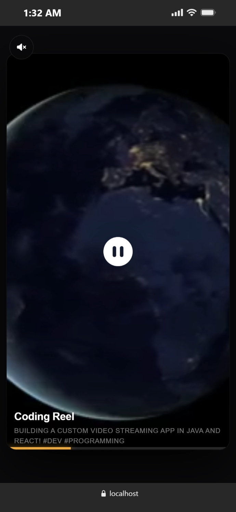

# ReelStudio: Secured Video Streaming & Swiper

ReelStudio is a high-performance, secured vertical reels video streaming application built with a **Spring Boot REST API** and a **React.js Frontend (Vite)**.



---

## Key Features

1. **Universal Video Format Support (FFmpeg Transcoding)**:
   - When *any* video format is uploaded (including **MP4, MOV, MKV, WebM, AVI, FLV, WMV, AVCHD**), the backend automatically runs FFmpeg to transcode it.
   - It outputs web-standard **H.264 video** and **AAC audio** with the **`+faststart`** optimization, allowing browsers to start playing immediately before the file finishes buffering.
2. **Secured Local Disk Storage**:
   - Transcoded videos are stored inside `api/uploads/video-store/` named by their content's SHA-256 checksum hash **without extensions** (e.g. `49f9c17ae34b2ede6...`), completely obfuscating their file type on the disk.
3. **Database Metadata Mapping**:
   - Keeps track of video details (original filename, custom title, description, size, type) inside the MySQL database under `video_metadata` table.
4. **Progressive Chunk-by-Chunk Streaming**:
   - Streams byte-range requests dynamically in progressive **1MB chunks** from disk using Spring's native `ResourceRegion`, enabling smooth scroll seeking.
5. **Double-Ended API Key Security**:
   - Secured by a 32-character API key: `e7b065a7d32c4b5e8f1d2c6b0a4e8d32`. Access is restricted via the `X-API-KEY` header for uploads/listings and URL query parameter `?apiKey=...` for browser video player streams.
6. **React Vertical Swiping UI**:
   - Custom snap scroll container with dynamic autoplay logic using `IntersectionObserver` (plays only the visible slide, pausing background reels).
   - Global sound mute/unmute toggle.
7. **Auto-Reload Support**:
   - Configured with `spring-boot-devtools` for Java auto-updates.

---

## Folder Directory Structure

```text
Video Streaming Java
├── api (Spring Boot Backend)
│   ├── pom.xml
│   ├── uploads
│   │   └── video-store (Raw secure extensionless files)
│   └── src
│       └── main
│           ├── java/.../VideoStreamingApplication.java
│           └── resources/application.properties
│
├── front (React.js Frontend)
│   ├── package.json
│   ├── .env (Configured API URL and Key)
│   └── src
│       ├── App.jsx (Reels logic)
│       └── index.css (Snap scroll layout and glassmorphism styling)
│
├── Demo.png (Application Screenshot)
└── .gitignore (Excludes build files, node_modules, and video binaries)
```

---

## Getting Started

### Terminal 1: Run the Backend (Java)
1. Navigate to the `api` folder:
   ```bash
   cd api
   ```
2. Start the Spring Boot server:
   ```bash
   .\mvnw spring-boot:run
   ```

### Terminal 2: Run the Frontend (React.js)
1. Navigate to the `front` folder:
   ```bash
   cd front
   ```
2. Start the Vite React development server:
   ```bash
   npm run dev
   ```
3. Open the local link in your browser (usually `http://localhost:5173`).

---

## API Documentation

### 1. Upload Video
- **Endpoint**: `POST /api/v1/videos/upload`
- **Headers**: `X-API-KEY: e7b065a7d32c4b5e8f1d2c6b0a4e8d32`
- **Body (`form-data`)**:
  - `file`: (Select video file)
  - `title`: Custom Reel Title (e.g. `My Coding Journey`)
  - `description`: Custom Reel Description (e.g. `Building dynamic stream reels! #programming`)

### 2. List Videos
- **Endpoint**: `GET /api/v1/videos/list`
- **Headers**: `X-API-KEY: e7b065a7d32c4b5e8f1d2c6b0a4e8d32`

### 3. Delete Video
- **Endpoint**: `DELETE /api/v1/videos/{videoKey}`
- **Headers**: `X-API-KEY: e7b065a7d32c4b5e8f1d2c6b0a4e8d32`

---

## Testing the API with Postman

We have included a pre-configured Postman Collection file at the root of the workspace: **[video-streaming-api.postman_collection.json](file:///c:/Users/asadu/OneDrive/Desktop/Video%20Streaming%20Java/video-streaming-api.postman_collection.json)**.

### How to Import and Use It:
1. Open the **Postman** desktop application.
2. Click the **Import** button in the top left corner.
3. Select or drag-and-drop the `video-streaming-api.postman_collection.json` file from the project folder.
4. Once imported, click on the **Video Streaming API** collection tab on the left sidebar.
5. Under the **Variables** tab of the collection, verify that:
   - `baseUrl` is set to `http://localhost:8080`
   - `apiKey` is set to `e7b065a7d32c4b5e8f1d2c6b0a4e8d32`
6. Run the requests:
   - **Upload Video**: Click the **Body** tab, hover over the `file` parameter value, select a local video from your disk, and click **Send**. (Optional: you can change the `title` and `description` text parameters in the form-data grid).
   - **List Videos**: Click **Send** to see all metadata stored in the database.
   - **Stream Video**: Streams the video chunk-by-chunk. You can test it by clicking the down arrow next to "Send" and choosing **Send and Download** to download the 1MB slice.
   - **Delete Video**: Paste the generated `videoKey` into the endpoint URL parameter and click **Send** to remove both the file and the metadata.

